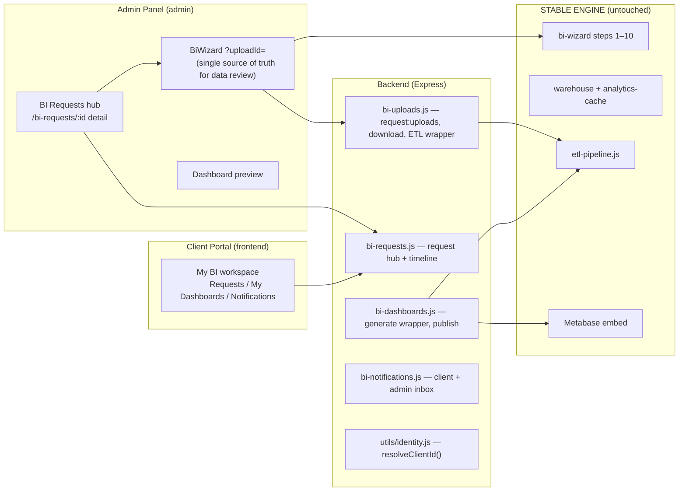
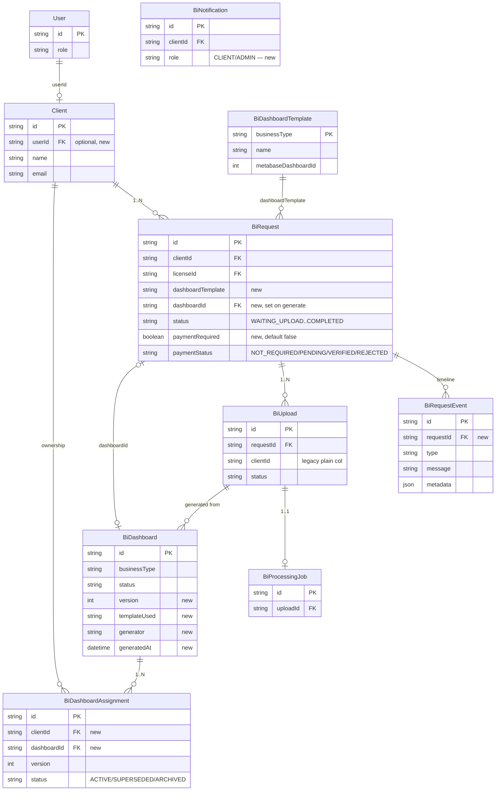
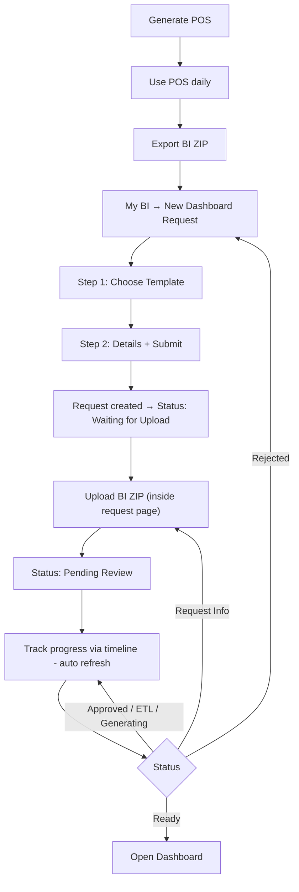
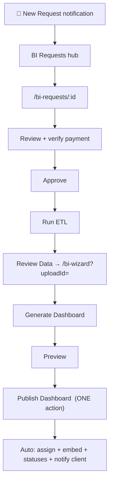
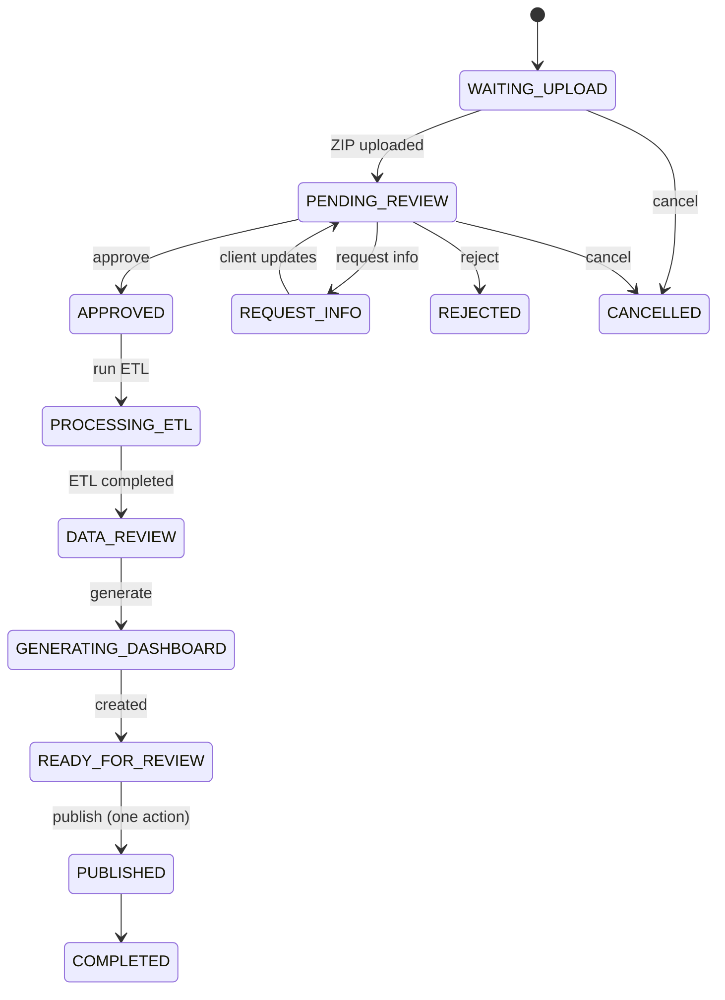
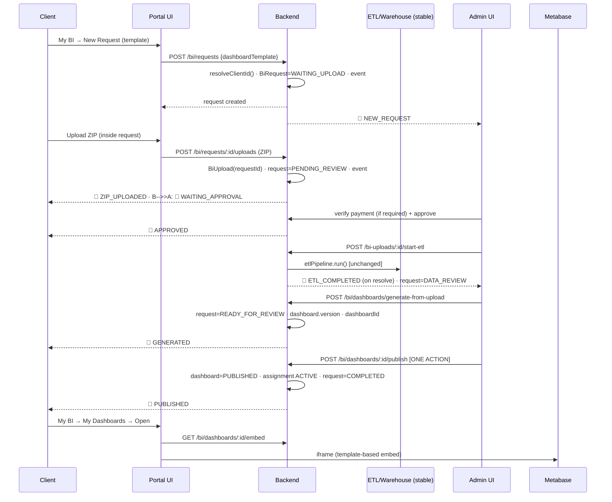

# CARTHAPOS — Client ↔ Admin BI Workflow Integration Plan (REVISED)

**Status:** APPROVED (v3). Implementation in progress.

## V3 — APPROVED REFINEMENTS (binding; override earlier text where conflicting)

1. **No `WAITING_UPLOAD` state.** ZIP upload is part of request creation. `POST /api/bi/requests` accepts the ZIP and creates request+upload atomically → status `PENDING_REVIEW`. Additional ZIPs are still allowed later via `POST /api/bi/requests/:id/uploads` (re-upload / replacement). Status list becomes: `PENDING_REVIEW → REQUEST_INFO / APPROVED → PROCESSING_ETL → DATA_REVIEW → GENERATING_DASHBOARD → READY_FOR_REVIEW → PUBLISHED → COMPLETED`, plus `REJECTED` / `CANCELLED`.
2. **`dashboardTemplate` is immutable** after request submission (creation-only; any later update rejects it).
3. **Every generated dashboard links to the exact `uploadId` it was built from** (`BiDashboard.uploadId`, already present, is asserted + surfaced in UI).
4. **Versioning always increments, never overwrites.** Generation always creates a **new** `BiDashboard` row (no 409-overwrite of prior dashboards); `version` = max(prior versions for client+businessType) + 1. Old dashboards remain intact.
5. **Publishing a new version auto-archives** prior ACTIVE `BiDashboardAssignment` rows for that client (→ `SUPERSEDED`) before inserting the ACTIVE one.
6. **Auto-polling is limited to active states only**: `PROCESSING_ETL`, `DATA_REVIEW`, `GENERATING_DASHBOARD`. Stable states (PENDING_REVIEW, APPROVED, READY_FOR_REVIEW, PUBLISHED, COMPLETED, REJECTED, CANCELLED, REQUEST_INFO) do not poll.
7. **Explicit schema-validation immediately after ZIP upload**: after the ZIP is stored, run the existing `etlPipeline.extractAndValidate()` in the background; persist a validation summary on the upload + a timeline event (`ZIP_VALIDATED` / `ZIP_INVALID`). Wizard preview flow untouched.
8. **Admin preview is mandatory before publication**: Publish is only enabled after preview (existing `AdminDashboardViewer` at `READY_FOR_REVIEW`/`DRAFT`).
9. **`businessType` vs `dashboardTemplate` are distinct**: `dashboardTemplate` = the client-chosen presentation template (template key). `businessType` = the ETL/warehouse concept, sourced from the uploaded ZIP metadata (not duplicated on the request). Request stores `dashboardTemplate` only; `businessType`/template name are exposed via the linked template + upload.
10. **Notifications are consequences of workflow events**: a single `recordEvent()` helper writes `BiRequestEvent` and *derives* notifications (client + admin) from the event type — status handlers never call `createNotification` directly.
11. **`BiDashboard.uploadId` is immutable.** Every dashboard version keeps the exact `uploadId` it was generated from; once created, generation/versioning code never updates `uploadId` (asserted on every generate call; surfaced in UI).
12. **Backend-computed `currentStep`.** Every serialized request payload exposes `currentStep` (derived from `status` via a single `getCurrentStep(status)` map). UI renders the timeline from this field — no client-side status→step logic.
13. **Backend-computed `progressPercent`.** Same serializer exposes `progressPercent` (from the step map). Client timeline bar reads it directly. Both fields are also returned by the poll endpoints used during active states.
14. **Duplicate-execution protection.** ETL, dashboard generation, and publish use guarded transitions — a conditional update (`WHERE status IN (allowed…)`) that returns the number of affected rows; `0` ⇒ 409 `STATE_CONFLICT` (double-click / concurrent admin). Only the winning transition writes the event + status.
15. **Complete audit trail.** `BiRequestEvent` carries `performedBy`, `performedByRole`, `performedAt` in addition to `type`/`message`/`metadata`. `recordEvent()` sets them from the authenticated actor (or `system` when triggered by the pipeline). Admin detail timeline renders actor + role + timestamp.
**Scope:** Make CarthaPOS behave like a commercial SaaS for the BI journey: request-first workflow, per-request timeline, one-action publish, assignment-based dashboard ownership, versioning. Connect existing modules. Do **not** touch the engine.

---

## HARD CONSTRAINTS — DO NOT MODIFY
ETL Pipeline · Warehouse · BI Export · Dashboard Generator · Metabase Integration · BI Wizard (steps 1–10) · Analytics Cache · Fact/Dimension generation.

Only these two engine entry points are **wrapped** (logic untouched, glue added around the call site):
- `POST /api/bi-uploads/:id/start-etl` (adds request-status sync + notifications)
- `POST /api/bi/dashboards/generate-from-upload` (adds request-status sync + versioning metadata + notifications)

Authentication is **out of scope**. Identity is handled by one helper, `resolveClientId(req)`, so the BI workflow never hardcodes or trusts fake client IDs. All new request/upload/dashboard/notification code must obtain the client through this single helper only.

---

## 1. Updated Architecture



Key principle: **Request is the hub.** Uploads, ETL, dashboard, assignment, and notifications all hang off the request. Every screen tells the user the single next step.

---

## 2. Updated Database Relationships



### Additive schema changes (no rewrite, no column removal)

| Model / field | Change | Purpose |
|---|---|---|
| `UserRole` enum | add `CLIENT` | client identity |
| `Client` | `userId String?` + FK → `User` | ownership mapping |
| `BiRequest` | `dashboardTemplate String?`, `paymentRequired Boolean @default(false)`, `dashboardId String?` + FK → `BiDashboard` (SetNull) | template drives generation; payment per-request; direct dashboard link |
| `BiRequestEvent` (**new**) | requestId FK (Cascade), `type`, `message`, `metadata Json?`, `createdAt`; index `requestId` | full timeline history |
| `BiDashboardAssignment` (**new**) | clientId FK, dashboardId FK, `version Int @default(1)`, `status` (ACTIVE/SUPERSEDED/ARCHIVED), `assignedAt`; index `clientId` | Client → Assignment → Dashboard ownership (regeneration / reassignment / versioning / multi-dashboard) |
| `BiDashboard` | `version Int @default(1)`, `templateUsed String?`, `generator String @default("wizard")`, `generatedAt DateTime?` | versioning metadata |
| `BiNotification` | `role String @default("CLIENT")` | client + admin inbox in one table |

**Note:** `BiDashboard.clientId` remains (denormalized current owner, kept in sync on publish) so the existing dashboard-generation code keeps working untouched. The **authoritative** ownership record is `BiDashboardAssignment`.

### Status model (two independent lifecycles)

**Request status** (drives UI + timeline):
```
WAITING_UPLOAD → PENDING_REVIEW → APPROVED → PROCESSING_ETL → DATA_REVIEW
              → GENERATING_DASHBOARD → READY_FOR_REVIEW → PUBLISHED → COMPLETED
(REQUEST_INFO / REJECTED branch from PENDING_REVIEW; CANCELLED by client)
```

**Payment status** (independent of request status):
```
NOT_REQUIRED   (paymentRequired = false, default)
PENDING  → VERIFIED  (paymentRequired = true)
         → REJECTED
```

> Request lifecycle and payment lifecycle never collide: `paymentRequired=false` skips payment entirely and goes straight to `PENDING_REVIEW`.

---

## 3. API Modifications

| Method + Path | Status | Change |
|---|---|---|
| `GET /api/bi/dashboard-templates?active=true` | extend use | Client template picker reads this (existing endpoint). Seed templates: restaurant, coffee_shop, retail, pharmacy, hotel, bakery (name/description; `metabaseDashboardId` placeholder 0 = "no MB dashboard yet"). |
| `POST /api/bi/requests` | **modified** | Create request only (no file). Client derived via `resolveClientId(req)`. Fields: `licenseId?`, `dashboardTemplate*`, `businessName`, `message`, `objectives/kpis`. Status `WAITING_UPLOAD`. Payment `NOT_REQUIRED` (default) or `PENDING` if `paymentRequired` (admin-set). Events: `REQUEST_CREATED`. Notifs: client `REQUEST_SUBMITTED`, admin `NEW_REQUEST`. |
| `POST /api/bi/requests/:id/uploads` | **new** | Multipart ZIP(s). Creates `BiUpload` **linked to the request** (`requestId`, `clientId` resolved), status `UPLOADED`. First upload moves request `WAITING_UPLOAD → PENDING_REVIEW`. Events: `ZIP_UPLOADED`. Notifs: client + admin `ZIP_UPLOADED`; admin `WAITING_APPROVAL`. Multiple uploads / re-uploads supported (latest = active). |
| `POST /api/bi/requests/:id/cancel` | **new** | Client cancels → `CANCELLED`, event `REQUEST_CANCELLED`. |
| `GET /api/bi/requests` | **modified** | Enriched: client, uploads[], dashboard, paymentStatus. Non-admin scoped to resolved client. |
| `GET /api/bi/requests/:id` | **modified** | Full detail + `events[]` timeline + uploads + dashboard. |
| `PATCH /api/bi/requests/:id/payment` | **modified** | `VERIFIED`/`REJECTED`/`NOT_REQUIRED`; event `PAYMENT_VERIFIED`/`PAYMENT_REJECTED`; client notif. Request status untouched (independent). |
| `PATCH /api/bi/requests/:id/approve` | **modified** | Allow approve when `paymentStatus ∈ {VERIFIED, NOT_REQUIRED}`. Event `REQUEST_APPROVED` + client notif. |
| `PATCH /api/bi/requests/:id/reject` · `request-info` | **modified** | Add events + client notif (already notify; add timeline). |
| `POST /api/bi-uploads/:id/start-etl` | **wrap only** | Before: request → `PROCESSING_ETL`, event `ETL_STARTED`, client notif `ETL_STARTED`. On pipeline resolve: request → `DATA_REVIEW`, event `ETL_COMPLETED`, admin notif `ETL_COMPLETED`. **`etlPipeline.run()` call unchanged.** |
| `POST /api/bi/requests/:id/run-etl` | **new** | Thin: resolve latest upload → same start-etl wrapper. |
| `POST /api/bi/dashboards/generate-from-upload` | **wrap only** | Before: request → `GENERATING_DASHBOARD`, event + client notif `DASHBOARD_GENERATED` (started). After: set `request.dashboardId`, dashboard `version/templateUsed/generator/generatedAt`, request → `READY_FOR_REVIEW`, event `DASHBOARD_GENERATED`. **Dashboard-creation call unchanged.** |
| `POST /api/bi/dashboards/:id/publish` | **new — ONE ACTION** | Validates `DRAFT`/`READY_FOR_REVIEW`. Automatically: set dashboard `PUBLISHED` + `assignedAt`; sync `dashboard.clientId`; upsert `BiDashboardAssignment` (ACTIVE, archive prior ACTIVE for same client+businessType); request → `PUBLISHED` → `COMPLETED`; events `DASHBOARD_PUBLISHED` + `REQUEST_COMPLETED`; client notif `DASHBOARD_PUBLISHED`. Embed stays served by existing `GET /:id/embed` (template-based) — no Metabase changes. |
| `GET /api/bi-uploads/:id/download` | **new** | Admin ZIP download (presently missing). |
| `GET /api/bi/notifications/admin` | **new** | Admin inbox (`role=ADMIN`). `PATCH /:id/read`, `POST /read-all` gain `role` support. |
| `GET /api/bi/dashboards` | **modified** | Expose `version`, assignment info, `generatedAt` for "My Dashboards". |

---

## 4. Backend Modifications

| File | Change |
|---|---|
| `backend/prisma/schema.prisma` | additive changes from §2 + migration |
| `backend/utils/identity.js` (**new**) | `resolveClientId(req)` → clientId from JWT user → `Client.userId`, else legacy `X-User-Id`/`userId` convention. **Single source of identity for all new BI code.** |
| `backend/routes/auth.js` (**new**) | minimal `register` / `login` / `me` (thin wrappers; creates `User`(CLIENT) + `Client` linked via `userId` on register). |
| `backend/utils/bi-status.js` (**new**) | shared constants: `REQUEST_STATUS`, `PAYMENT_STATUS`, `EVENT_TYPES`, `NOTIF_TYPES`. |
| `backend/routes/bi-requests.js` | request hub: create, `:id/uploads`, `:id/cancel`, enriched list/detail, payment/approve/reject/info with events + notifs; `createRequestEvent()` helper. |
| `backend/routes/bi-uploads.js` | start-etl wrapper (request status sync + notif), `:id/download`; keep all existing endpoints. |
| `backend/routes/bi-dashboards.js` | generate wrapper (versioning + request link + notif), new `POST /:id/publish`. |
| `backend/routes/bi-notifications.js` | role-aware admin inbox. |
| `backend/server.js` | mount `auth.js`; `AUTH_REQUIRED` flag (default false → current dev behavior unchanged). |

**Files that must NOT appear in this diff:** `services/etl-pipeline.js`, `services/warehouse-service.js`, `services/analytics-cache-service.js`, `services/bi-model-registry.js`, `services/bi-schema-registry.js`, `services/data-preparation-service.js`, `services/bi-data-utils.js`, `services/bi-insight-generator.js`, and all 10 `BiWizard` step files.

---

## 5. Frontend Modifications

### Client (`frontend/`)
| File | Change |
|---|---|
| `pages/dashboard/BiWorkspace.tsx` (**new**) | "My BI" — 3 tabs: **Dashboard Requests**, **My Dashboards**, **Notifications**. Auto-poll while any request is active. Unread badge. No standalone upload page. |
| `pages/dashboard/RequestWizard.tsx` (**new**) | Step 1: pick **Dashboard Template** (from `GET /api/bi/dashboard-templates?active=true`). Step 2: request details (business name, message, objectives/KPIs). Step 3: submit → `POST /api/bi/requests` → lands on request page in "Waiting for Upload". |
| `pages/dashboard/RequestDetail.tsx` (**new**) | One page, everything about the request: general info, business type, template, **status**, **timeline** (events with times), **uploads** (add new ZIP → `POST :id/uploads`), **notifications**, actions: *Upload New ZIP*, *View Dashboard* (when READY), *Cancel Request*. Next-step CTA always visible. |
| `pages/dashboard/MyDashboards.tsx` (**new**) | Published dashboard cards (name, business type, created date, status, version) → open embedded viewer (reuse `EmbeddedDashboardContainer`). |
| `components/dashboard/DashboardLayout.tsx` | Nav: single **"My BI"** → `/dashboard/bi` (replaces "Export BI" + "Tableaux de bord BI"). |
| `pages/dashboard/Dashboard.tsx` | Remove old BI request dialog; entry point → `/dashboard/bi`. |
| `App.tsx` | New routes; redirect old ones. |

### Admin (`admin/`)
| File | Change |
|---|---|
| `pages/BIRequests.jsx` | **Hub**: columns Client · Business Type · Template · Upload Status · Payment Status · Request Status; row → detail; notification-driven refresh. |
| `pages/AdminRequestDetail.jsx` (**new**) | Command center: client info, payment, uploads (+download ZIP), ETL status, dashboard status, timeline, logs, and the **linear action buttons** that appear only when enabled: Verify Payment → Approve → **Run ETL** → **Review Data** (→ `/bi-wizard?uploadId=<id>`) → **Generate Dashboard** → **Preview** → **Publish**. |
| `components/layout/Layout.jsx` | Admin notification bell (unread count from `/api/bi/notifications/admin`). |
| `App.jsx` | Route `/bi-requests/:id`. |

**BiWizard resume:** `/bi-wizard?uploadId=<id>` prefills and auto-advances to the first incomplete step (Validation → Preparation → … → Load → Dashboard) based on `upload.status` from `GET /api/bi-uploads/:id`. The wizard itself is unchanged; only its initial-state wiring reads the upload status.

---

## 6. UI Mock Flow

**Client — My BI workspace**
```
┌───────────────────────────────────────────────────────────────┐
│ Carthapos   My BI          🔔 3                               │
├───────────────────────────────────────────────────────────────┤
│ ┌─ Dashboard Requests ──┐ ┌─ My Dashboards ─┐ ┌─ Notifications │
│ │                       │ │                │ │               │
│ │ [+ New Dashboard Req] │ │  ▓ Restaurant  │ │ • Published   │
│ │                       │ │  ▓ Coffee Shop │ │ • Approved    │
│ │ ▓ Restaurant · Waiting│ │  ▓ Retail      │ │ • ZIP uploaded│
│ │   for Upload  [Open]  │ │  ...           │ │  ...          │
│ │ ▓ Coffee · Pending    │ │                │ │               │
│ │   Review      [Open]  │ │                │ │               │
│ └───────────────────────┘ └────────────────┘ └───────────────┘
└───────────────────────────────────────────────────────────────┘
```

**Client — New Dashboard Request (wizard)**
```
Step 1  Choose Template      Step 2  Details      Step 3  Confirm
  (o) Restaurant                 Business name: ___        Submit
  ( ) Coffee Shop                Message: ____             →
  ( ) Retail                     Objectives: ___
  ( ) Pharmacy                   KPIs: ___
```

**Client — Request Detail**
```
Restaurant Dashboard ── [Status: Pending Review]

Timeline
  09:00 Request Created      ✓
  09:05 ZIP Uploaded         ✓
  09:07 Payment Verified     ✓
  09:10 Approved             ✓
  09:12 ETL Started          ◐ (in progress)

Uploads        [Upload New ZIP]
  bi_export_2026.zip · 4.2 MB · UPLOADED

Next step: wait — ETL is running.
```

**Admin — /bi-requests/:id**
```
Client: Acme Café      Business: restaurant   Payment: VERIFIED

Uploads: bi_export_2026.zip [Download]
ETL:  COMPLETED        Dashboard: DRAFT v1

Timeline ▸ (full)

Actions
  [Run ETL]          → only when APPROVED
  [Review Data]      → /bi-wizard?uploadId=… (only when DATA_REVIEW)
  [Generate Dashboard] → only when DATA_REVIEW
  [Preview]          → /bi-dashboard/:id (when DRAFT/READY_FOR_REVIEW)
  [Publish Dashboard] → ONE button, only when READY_FOR_REVIEW/DRAFT
```

---

## 7. Client Workflow



---

## 8. Admin Workflow



---

## 9. Request Lifecycle



Payment is orthogonal: `NOT_REQUIRED` → no gate; `PENDING → VERIFIED` (or `REJECTED`) required before `approve`.

---

## 10. Sequence Diagram — Complete BI Process



---

## Implementation Order (after approval)

1. **Schema + migration** (additive) + `bi-status.js` constants.
2. **Identity glue**: `utils/identity.js`, `routes/auth.js`, `AUTH_REQUIRED` gate (default off).
3. **Request hub backend**: requests create/list/detail/cancel, `:id/uploads`, events, notifications, payment/approve/reject/info updates.
4. **Wrappers**: start-etl, generate-from-upload, publish, admin ZIP download, admin notifications.
5. **Client workspace** (My BI, wizard, request detail, my dashboards, nav, redirects).
6. **Admin hub** (BIRequests columns, `/bi-requests/:id`, bell).
7. **BiWizard resume** wiring (`?uploadId=` → first incomplete step).
8. **Verification**: run `npm run lint`/build for both frontends, confirm engine files untouched via git diff, manual smoke test of a full request → publish cycle.

## Verification guarantee
- `git diff --stat` at the end must show **zero** changes in: `backend/services/`, `backend/utils/` (except new files), `admin/src/pages/wizard/`, `pos-template/` BI export files.
- ETL, warehouse, generation, Metabase behavior remains byte-for-byte identical.

---

**Awaiting your approval to begin implementation (Phase 1 → Schema).**
